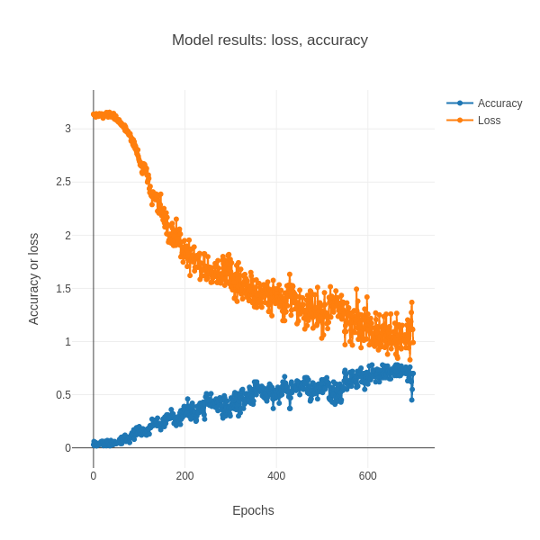

#  text_character_classification 

The purpose of this repository is to demonstrate character prediction of the alphabet (ABCDEFGHIJKLMNOPQRSTUVWXYZ) using different model definitions of the LSTM model. For example, given the character A, the model should predict B. The goal is to compare accuracy of different model definitions, to understand which model definitions are better than others for this simplistic alphabet data and for text. 

[Current working version] https://codesolutions2.github.io/text_character_classification/index.html 

Below is a figure of the results for the best performing model (3 layer LSTM - 1 Dense layer), that acheived accuracy of 0.78.

